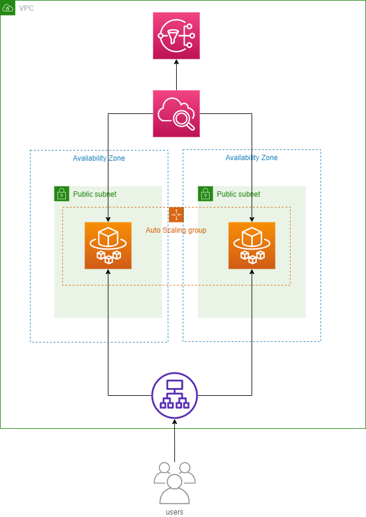

<h3 align="center">Deploying Web Application in AWS</h3>

# Context
This is step-by-step guide to create a Flask web application in AWS that deploys using Cloudformation and integrated in a CI/CD pipeline.

# Introduction
We will be running the webapp on AWS Fargate.
  
**AWS Fargate** is a managed service that allows you to quickly run containerized workloads in the cloud. developers only have to upload their container to the service and aws will take care of maintaining the underlying server. (security updates, patching,..)

# Architecture Diagram
  

# Environment Setup
We will be using AWS CLI to run these commands.
 
**The AWS Command Line Interface (CLI)** is a unified tool to manage your AWS services. With just one tool to download and configure, you can control multiple AWS services from the command line and automate them through scripts.
 1. Create a default vpc    

 `aws ec2 create-default-vpc`

2. Create atleast 2 subnets in different availiblity zones. 
    AWS fargate needs atlest 2 subnets in different AZ's to run. 

`aws ec2 create-default-subnet --availability-zone us-east-1a --dry-run`
 

`aws ec2 create-default-subnet --availability-zone us-east-2a` 

# Email validation

  You will need to validate your email address before deploying the Cloudformation template. 

`aws ses verify-email-identity --email-address sender@example.com`

# ECR 
**Amazon ECR** is a fully managed container registry offering high-performance hosting, so you can reliably deploy application images and artifacts anywhere.

1) You need to create an ECR repository in your AWS account.
2) Select the created ECR and click on "View Push Commands"
3) In your terminal, navigate to the project directory
4) Select the appropriate OS and Follow up the instructions by copy pasting commands in your terminal 

# SSL 
Create a Self signed certificate from this article and copy the ACM ARN. The ACM ARN should like this, "arn:aws:iam::746109777700:server-certificate/CSC" We need to use this self signed certificate to attach it to our load balancer for SSL support. 
 
  https://medium.com/@francisyzy/create-aws-elb-with-self-signed-ssl-cert-cd1c352331f.
       

# Metrics :
1. we will use CPU usage as a scalig metric here. The moment CPU usage will reach upto the specified value, auto scaling gets triggered.
this will create desired no. of instances (replica) and can also be downscaled automatically if required.
here we use horizontal scaling

1. We will to change the min and max containers to autoscale between dev and prod enviorments. We don't need to run many containers in the dev enviorment. 

# Assumptions

1) Usage of ECR to store the docker container. We cannot define this resource in a cloud formation template. This is just infrastructure that must be created manually.
2) Pre-configure the enviorment with networking before deploying the cloudformation template

3) Setup separate pipelines staging and production. Whenever there is a new change in the code, the code will automatically deployed to the respective environment. We can use github here to setup pipelines as github action provides many other features to customize the pipelines as per requiremennt

# Code Deployment

There are many ways to automate deploying code updates to this enviroment. For starters, I assume that code updates are meant for the Flask application, and code updated to the cloudformation template itself. 

I would use code pipeline to update the application, this is an AWS service that encompases 3 services; (Code commit, code deploy, and code build). 

# CI/CD Pipeline
Because the code is packaged inside a Docker container, I would first:
1. Push the local code out to a github repository
2. Have Github Webhooks enabled so that Codepipeline knows when new code has been checked into the Repository. 
3. Pull the code out from the Github Repo, into AWS. 
4. Run codebuild on that code, to build a docker image. 
5. And then push dockerimage into an ECR repository and create a new AWS enviorment to test the newly built code. 

# Application Downtime

 **#1 Proposition**  
Downtime problem can be solved through loadbalancing. We can detach the nodes need to be updated, out of the load balancer (diverting the traffic to other nodes which handles the traffic without any downtime) and again attach them to load balancer. In this way we can update all nodes without any downtime.

 **#2 Proposition**  
Using a method called Blue/green Deployments.The production enviorment that we don't ever want to go down, and the NewProduction envriorment, which contains updated code.
We want to move slowly people from your production enviorment over to the NewProduction enviorment. And then finally deccomission the old product enviorment. 
 
 DNS routing could be a way to accomplish this.